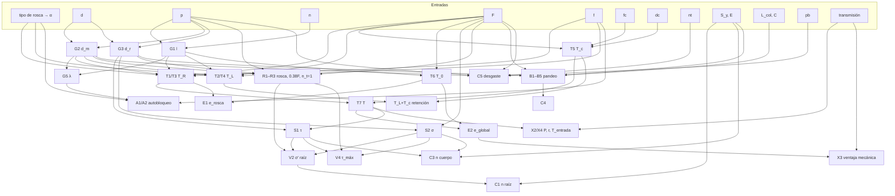

# Tornillo de potencia — Mapa metodológico (Loop 1)

> Fuente primaria: Budynas & Nisbett, *Diseño en ingeniería mecánica de Shigley*, 9ª ed. (español), McGraw-Hill.
> Verificado directamente del PDF `Diseño II/Material de Estudio/Diseno_en_ingenieria_mecanica_de_Shigley.pdf`:
> §8-1 (pp. 392–395), §8-2 (pp. 396–403), §4-11 a §4-13 (pp. 175–178), §5-5 (pp. 213–216).
>
> Este documento es el contrato del motor de cálculo. Cada ecuación implementada debe aparecer aquí con su origen.

## 0. Convenciones

**Unidades internas** (coherentes, sin factores ocultos): longitud en **mm**, fuerza en **N**, esfuerzo en **MPa = N/mm²** y par en **N·mm**. Las entradas en otras unidades (in, lbf, kpsi, psi, lbf·in, ft/min) se convierten al entrar, y cada conversión queda registrada para mostrarla en la traza de cálculo.

**Signos:** compresión negativa, como en el libro (σ = −4F/πd_r², σ_B = −2F/…). En la UI se muestra la magnitud junto con la palabra "compresión".

**Referencias solo internas (decisión del usuario, Loop 1):** los números de ecuación, las marcas de origen y los nombres de libros viven **únicamente** en los metadatos del motor (`ref`, `origin`) y en este documento. **No se muestran en la traza de cálculo ni en la UI.**

**Marcas de origen de cada nodo (internas):**

| Marca | Significado |
|---|---|
| `SHIGLEY` | Ecuación numerada o resultado explícito del libro |
| `DERIVADA` | Despeje algebraico o extensión explícita de una ecuación del libro (se muestra la ecuación de partida) |
| `ESTÁTICA` | Equilibrio o cinemática elemental que el libro da por sabida |
| `EXTERNA` | Dato de una fuente distinta a Shigley |

---

## 1. Variables

| Símbolo | Significado | Unidad | Rol posible |
|---|---|---|---|
| d | Diámetro mayor | mm | entrada · incógnita (dimensionar) |
| p | Paso (p = 1/N en serie pulgada) | mm | entrada · incógnita |
| n | Número de entradas | — | entrada · incógnita (rama avance) |
| l | Avance, l = n·p | mm | calculada |
| α | Semiángulo de rosca (cuadrada 0°, Acme 14.5°) | ° | derivada del tipo de rosca |
| d_m | Diámetro medio | mm | calculada |
| d_r | Diámetro menor (raíz) | mm | calculada |
| λ | Ángulo de avance | ° | calculada |
| F | Carga axial | N | entrada · incógnita (capacidad) |
| f | Coef. fricción de la rosca | — | entrada (o desde la Tabla 8-5) |
| f_c | Coef. fricción del collarín (operación / arranque) | — | entrada (o desde la Tabla 8-6) |
| d_c | Diámetro medio del collarín | mm | entrada |
| T_R, T_L | Par para subir / bajar, solo rosca | N·mm | calculada |
| T_c | Par del collarín | N·mm | calculada |
| T | Par total en el tornillo | N·mm | calculada · entrada (capacidad) |
| T_0 | Par sin fricción | N·mm | calculada |
| e | Eficiencia | — | calculada |
| n_t | Filetes en contacto | — | entrada · incógnita (desgaste) |
| H | Longitud de tuerca, H = n_t·p | mm | calculada / entrada |
| S_y, E | Resistencia de fluencia y módulo del tornillo | MPa | entrada / material |
| p_b | Presión de apoyo segura | MPa | Tabla 8-4 / entrada |
| L_col, C | Longitud de columna y constante de extremos | mm, — | entrada (solo en compresión) |
| P, r | Fuerza en la palanca y brazo | N, mm | entrada · incógnita |
| i, η_g | Relación y eficiencia del reductor | — | entrada |
| N_rpm | Velocidad de giro | rpm | opcional |

---

## 2. Ecuaciones

### 2.1 Geometría (§8-1, Fig. 8-3, Ej. 8-1a)

| Id | Ecuación | Origen |
|---|---|---|
| G1 | l = n·p | SHIGLEY §8-1 |
| G2 | d_m = d − p/2 | SHIGLEY Ej. 8-1(a) |
| G3 | d_r = d − p | SHIGLEY Ej. 8-1(a) |
| G4 | profundidad = ancho = p/2 (cuadrada, Fig. 8-3a); Acme 2α = 29° (Fig. 8-3b). **Se muestra en la etapa de geometría** (inciso a del ejercicio) | SHIGLEY |
| G5 | tan λ = l / (π d_m) | SHIGLEY (Fig. 8-6) |

**Supuesto:** G2 y G3 son las relaciones de la Fig. 8-3 para roscas de potencia (cuadrada y Acme).

### 2.2 Pares (§8-2)

| Id | Ecuación | Origen | Validez |
|---|---|---|---|
| T1 | $T_R=\frac{Fd_m}{2}\,\frac{l+\pi f d_m}{\pi d_m-fl}$ | SHIGLEY 8-1 | rosca cuadrada; π d_m − f l > 0 |
| T2 | $T_L=\frac{Fd_m}{2}\,\frac{\pi f d_m-l}{\pi d_m+fl}$ | SHIGLEY 8-2 | rosca cuadrada |
| T3 | $T_R=\frac{Fd_m}{2}\,\frac{l+\pi f d_m\sec\alpha}{\pi d_m-fl\sec\alpha}$ | SHIGLEY 8-5 | rosca con ángulo; **el libro la declara aproximación** (desprecia la inclinación por λ) |
| T4 | $T_L=\frac{Fd_m}{2}\,\frac{\pi f d_m\sec\alpha-l}{\pi d_m+fl\sec\alpha}$ | **DERIVADA** de 8-2 con la regla del libro ("los términos de fricción deben dividirse entre cos α") | rosca con ángulo |
| T5 | $T_c=\frac{F f_c d_c}{2}$ | SHIGLEY 8-6 | carga concentrada en d_c; en collarines grandes el libro remite al modelo de embragues de disco → aviso |
| T6 | $T_0=\frac{Fl}{2\pi}$ | SHIGLEY (g) | — |
| T7 | T = T_R + T_c (subir); T_bajar = T_L + T_c | SHIGLEY Ej. 8-1(b) | — |
| T8 | Par de arranque: T3/T1 + T5 con f_c de **arranque** (Tabla 8-6) | DERIVADA (Tabla 8-6 da f_c de arranque) | solo si hay par de materiales de la Tabla 8-6 |

### 2.3 Eficiencia y autobloqueo

| Id | Ecuación | Origen |
|---|---|---|
| E1 | e_rosca = F l / (2π T_R) | SHIGLEY 8-4 |
| E2 | e_global = F l / (2π (T_R + T_c)) | SHIGLEY Ej. 8-1(c) "eficiencia global" |
| A1 | Autobloqueo, cuadrada: π f d_m > l ⇔ f > tan λ | SHIGLEY 8-3 |
| A2 | Autobloqueo con ángulo: T4 > 0 ⇔ π f d_m sec α > l ⇔ f sec α > tan λ | **DERIVADA** de T4 |
| A3 | Criterio: T_L ≤ 0 → "la carga baja sola" (el libro: "será negativo o igual a cero") | SHIGLEY |

**Nota del libro (Ej. 8-1):** aunque la rosca no sea autobloqueante (T_L < 0), la fricción del collarín puede retener la carga: T_L + T_c > 0. El motor evalúa y muestra **por separado** el autobloqueo de la rosca (A1/A2) y la retención del conjunto (T_L + T_c > 0).

### 2.4 Esfuerzos en el cuerpo

| Id | Ecuación | Origen | Nota |
|---|---|---|---|
| S1 | τ = 16T / (π d_r³) | SHIGLEY 8-7 | **Supuesto:** T = T_R + T_c, igual que el Ej. 8-1(d) ("par T_R en el exterior del cuerpo" con 26.18 N·m). Depende de dónde esté el collarín; se muestra como supuesto editable |
| S2 | σ = ∓4F / (π d_r²) | SHIGLEY 8-8 | signo según compresión o tensión |

### 2.5 Pandeo (solo con carga de compresión; §4-12/4-13 citado en §8-2)

| Id | Ecuación | Origen |
|---|---|---|
| B1 | k = d_r/4 (sección circular) | SHIGLEY Ej. 4-16(a) |
| B2 | $(l/k)_1=\left(\frac{2\pi^2CE}{S_y}\right)^{1/2}$ | SHIGLEY 4-45 |
| B3 | Euler: $\frac{P_{cr}}{A}=\frac{C\pi^2E}{(l/k)^2}$ si l/k > (l/k)₁ | SHIGLEY 4-44 |
| B4 | Johnson: $\frac{P_{cr}}{A}=S_y-\left(\frac{S_y}{2\pi}\frac{l}{k}\right)^2\frac{1}{CE}$ si l/k ≤ (l/k)₁ | SHIGLEY 8-9 ≡ 4-46 |
| B5 | A = π d_r²/4; n_pandeo = P_cr/F | DERIVADA |

**Errata detectada:** el texto de §8-2 en español dice "ecuación (4-43)" para Johnson, pero en el cap. 4 Johnson es la **4-46** (la 4-43 es Euler). Se cita "8-9 (= 4-46)".
**Tabla 4-2, constante C:** empotrado-libre ¼ (teórico, conservador y recomendado); articulado-articulado 1 / 1 / 1; empotrado-articulado 2 / 1 / 1.2; empotrado-empotrado 4 / 1 / 1.2. El valor recomendado solo se usa con factores de seguridad amplios y carga conocida con exactitud. **Por defecto se usa el conservador.**

### 2.6 Esfuerzos en la rosca (§8-2, Fig. 8-8)

| Id | Ecuación | Origen |
|---|---|---|
| R1 | σ_B = −2F / (π d_m n_t p) | SHIGLEY 8-10 |
| R2 | σ_b = 6F / (π d_r n_t p) | SHIGLEY 8-11 |
| R3 | τ = 3F / (π d_r n_t p) (en el centro de la raíz; **cero en la parte superior**) | SHIGLEY 8-12 |
| R4 | Reparto de carga en la tuerca: 1ª rosca 0.38F, 2ª 0.25F, 3ª 0.18F, …, 7ª libre. **Esfuerzo máximo: usar 0.38F y n_t = 1** | SHIGLEY §8-2 |

### 2.7 Estado combinado en la raíz (Ej. 8-1 g, h)

| Id | Ecuación | Origen |
|---|---|---|
| V1 | σx = σ_b (R2 con 0.38F, n_t = 1), σy = σ (S2), σz = 0, τyz = τ (S1), τxy = τzx = 0 | SHIGLEY §8-2 |
| V2 | $\sigma'=\frac{1}{\sqrt2}\left[(\sigma_x-\sigma_y)^2+(\sigma_y-\sigma_z)^2+(\sigma_z-\sigma_x)^2+6(\tau_{xy}^2+\tau_{yz}^2+\tau_{zx}^2)\right]^{1/2}$ | SHIGLEY 5-14 |
| V3 | Principales: σx es principal; los otros salen del plano y–z, σ = σy/2 ± √((σy/2)² + τyz²) | SHIGLEY 3-13 (Ej. 8-1) |
| V4 | τ_máx = (σ1 − σ3)/2 | SHIGLEY 3-16 (Ej. 8-1h) |

### 2.8 Criterios de diseño (verificaciones)

| Id | Criterio | Origen |
|---|---|---|
| C1 | Fluencia en la raíz (ED): n = S_y / σ′ ≥ n_obj | SHIGLEY 5-19 |
| C2 | Fluencia en la raíz (ECM, alternativa conservadora): n = S_y / (2 τ_máx) | SHIGLEY 5-3 |
| C3 | Cuerpo: σ′ = (σ² + 3τ²)^½ (5-15, plano), n = S_y/σ′ | SHIGLEY 5-15/5-19 |
| C4 | Pandeo: n_p = P_cr/F ≥ n_obj (solo compresión) | DERIVADA (4-44/4-46) |
| C5 | Desgaste: \|σ_B\| con **n_t real y F completa** ≤ p_b (Tabla 8-4) | DERIVADA: la Tabla 8-4 da presiones "seguras… para proteger del desgaste"; σ_B de 8-10 es la presión nominal |
| C6 | Autobloqueo requerido (si el usuario lo exige): A1/A2 | SHIGLEY 8-3 |
| C7 | Validez de T1/T3: π d_m − f l sec α > 0 | DERIVADA (denominador) |
| C8 | Geometría: 0 < p < d; d_r > 0; n entero ≥ 1 | ESTÁTICA |
| C9 | Velocidad de frotamiento dentro de la fila elegida de la Tabla 8-4 | SHIGLEY Tabla 8-4 |

**No se usan umbrales inventados.** No hay "n < 2" fijo: el usuario define n_obj y la UI muestra el criterio exacto.

### 2.9 Transmisión (ESTÁTICA)

| Id | Ecuación | Configuración |
|---|---|---|
| X1 | T = T_entrada | A — collarín / accionamiento directo (Fig. 8-7b) |
| X2 | T = P·r (una mano) · T = 2P·r (barra con dos manos) | B — palanca o manivela |
| X3 | VM = F/P = 2π r e_global / l | B (combina X2 con 8-4) |
| X4 | T = T_entrada · i · η_g | C — reductor (Fig. 8-4, gato con sinfín). η_g es una entrada declarada |
| X5 | ω = 2π N/60; v = N·l; H = T·ω | cinemática (opcional) |
| X6 | V_frot = π d_m N (convertido a ft/min para la Tabla 8-4) | ESTÁTICA |

---

## 3. Tablas de datos

- **Tabla 8-3 — Pasos preferidos Acme (in):** d (p) = ¼ (1/16), 5/16 (1/14), ⅜ (1/12), ½ (1/10), ⅝ (⅛), ¾ (⅙), ⅞ (⅙), 1 (⅕), 1¼ (⅕), 1½ (¼), 1¾ (¼), 2 (¼), 2½ (⅓), 3 (½).
  *Catálogo del motor = el `public/data/threads_acme.json` actual (½ a 2 in). **No se agregan** ¼, 5/16, ⅜, 2½ ni 3 in: en un tornillo de potencia un paso más grande aumenta los esfuerzos en el núcleo y la probabilidad de perder el autobloqueo (decisión del usuario).*
- **Tabla 8-4 — p_b seguro (psi):** tornillo acero con tuerca de bronce, baja velocidad: 2 500–3 500 · ac./bronce ≤10 ft/min: 1 600–2 500 · ac./hierro fundido ≤8 ft/min: 1 800–2 500 · ac./bronce 20–40 ft/min: 800–1 400 · ac./hierro 20–40 ft/min: 600–1 000 · ac./bronce ≥50 ft/min: 150–240.
  *Política de selección de p_b (decisión del usuario):*
  - *Dentro de un rango (p. ej. 1 600–2 500 psi): se usa el **extremo inferior** (conservador).*
  - *Velocidad en un hueco de la tabla (10–20 o 40–50 ft/min en bronce; >8 ft/min fuera de 20–40 en hierro): **criterio conservador por defecto = fila de la velocidad inmediatamente superior**.*
  - *Opción alternativa: **interpolación lineal** entre las filas vecinas. La traza lo indica explícitamente ("p_b interpolado linealmente entre … y …").*
  - *Por encima de la última fila: se usa la última fila y se marca "atención".*
- **Tabla 8-5 — f de pares roscados** (tornillo \ tuerca: acero, bronce, latón, hierro fundido): acero seco 0.15–0.25, 0.15–0.23, 0.15–0.19, 0.15–0.25 · acero con aceite de máquina 0.11–0.17, 0.10–0.16, 0.10–0.15, 0.11–0.17 · bronce 0.08–0.12, 0.04–0.06, —, 0.06–0.09. Texto: "alrededor de 0.10 a 0.15".
- **Tabla 8-6 — f_c del collarín (operación / arranque):** acero suave/hierro fundido 0.12/0.17 · acero duro/hierro fundido 0.09/0.15 · acero suave/bronce 0.08/0.10 · acero duro/bronce 0.06/0.08.
  *Los rodamientos no están en la tabla: si el collarín es un rodamiento, f_c es una entrada del usuario.*
- **Tabla 4-2 — C:** ver §2.5.
- **Tr ISO 2904: NO se implementa** (decisión del usuario; solo sería una comparación posible, no se usa en el curso). Para tamaños métricos o fuera de catálogo, el usuario introduce d y p a mano.

---

## 4. Grafo de dependencias

---

## 5. Modelo de cálculo progresivo (decisión del usuario, Loop 2)

No hay campos obligatorios por rama. El motor es un **grafo de reglas con alternativas**: cada magnitud derivada declara una o más listas de dependencias (por ejemplo, F ← dada | despejada de lo aplicado en la entrada). En cada cambio:
1. Se calcula por punto fijo todo nodo con alguna alternativa satisfecha (ejemplo: d_r en cuanto existen d y p).
2. Cada nodo pendiente informa sus **datos faltantes mínimos**, expandidos hasta las entradas del usuario.
3. La UI lo muestra **sin bloquear**: chips "falta …" en la traza, un punto en los campos que desbloquean cálculos y una sugerencia "próximo dato útil (desbloquea N resultados)".
4. **Datos de más:** si el usuario da la carga y también lo aplicado en la entrada, no se descarta ninguno. Se calcula el requerido y se compara en la verificación "entrada suficiente".
5. El **objetivo** (Analizar, Capacidad, …) solo orienta qué resultados se resaltan y qué campos se sugieren; no restringe.
6. El **apoyo de empuje es opcional**. Al elegirlo aparecen f_c y d_c, que alimentan T, la retención, τ del cuerpo y la potencia.

Validado en el prototipo del Loop 2 con el ejercicio de rosca cuadrada de 32 mm (incisos a–h completos) y con la rama de capacidad con palanca (F despejada de P y r).

## 5.1 Ramas del cálculo (qué conoce el usuario)

| Rama | El usuario conoce | Incógnita | Mecanismo | Luego |
|---|---|---|---|---|
| **R1 Analizar** | geometría (d, p, n, rosca), F, f, [collarín], [material], [transmisión] | todo lo demás | evaluación directa del grafo | verificaciones C1–C9 |
| **R2 Capacidad** | geometría, fricciones, par disponible **o** (P, r) **o** (T_motor, i, η_g) | F_máx | T es lineal en F: F = T / [ (d_m/2)·(l+πf d_m secα)/(πd_m − f l secα) + f_c d_c/2 ] — **DERIVADA** de T1/T3 + T5 | R1 con F = F_máx |
| **R3 Accionamiento** | geometría, F, fricciones, transmisión parcial | P, r o T_motor | R1 → T, y X2/X4 invertidas | VM (X3) |
| **R4 Dimensionar** | F, material (S_y, E), n_obj, rosca, par de materiales (f, p_b), [L_col, C], [n] | d, p, n_t, H | (1) arranque d_r,min = √(4F n_obj/(π S_y)) — **DERIVADA** de 8-8; (2) barrido del catálogo Acme (½–2 in) **o** de una serie d/p definida por el usuario con R1 completo por candidato; (3) n_t,min = ⌈2F/(π d_m p p_b)⌉ — **DERIVADA** de 8-10 + C5; (4) se elige el menor d que cumple C1, C3, C4, C5 [y C6] | tabla de candidatos con el criterio que rechaza a cada uno |
| **R5 Avance** | d (y p), f, [requisito de autobloqueo], [e_obj] | n (entradas) o l_máx | l_máx = π f d_m cos α (despeje de A1/A2); n_máx = ⌊l_máx/p⌋; para e_obj se barre n = 1…4 | R1 con la n elegida |

**Datos faltantes:** cada nodo declara sus `requires`. El solver lista los faltantes del camino más corto y ofrece alternativas. Ejemplo: "T_R necesita f → escríbalo o elija un par de materiales (Tabla 8-5)".
**Combinaciones imposibles:** p ≥ d; π d_m − f l sec α ≤ 0 (8-1/8-5 sin sentido físico); T disponible ≤ T_c,por unidad de F en R2; tabla vacía en R4 ("ningún tamaño cumple; el criterio que gobierna es …").

---

## 6. Caso de verificación: Ejemplo 8-1 (reproducido numéricamente)

Datos: rosca cuadrada, d = 32 mm, p = 4 mm, rosca doble, f = f_c = 0.08, d_c = 40 mm, F = 6.4 kN.

| Magnitud | Libro | Verificación |
|---|---|---|
| d_m, d_r, l | 30, 28, 8 mm | ✔ |
| T_R (rosca) | 15.94 N·m | 15.937 |
| T_c | 10.24 N·m | 10.240 |
| T subir | 26.18 N·m | 26.18 |
| T_L (rosca) | −0.466 N·m | −0.466 |
| T bajar | 9.77 N·m | 9.774 |
| e global | 0.311 | 0.311 |
| τ cuerpo | 6.07 MPa | 6.07 |
| σ cuerpo | −10.39 MPa | −10.39 |
| σ_B (0.38F, n_t = 1) | −12.9 MPa | −12.90 |
| σ_b (0.38F, n_t = 1) | 41.5 MPa | 41.47 |
| σ1, σ2, σ3 | 41.5, 2.79, −13.18 | 41.47, 2.80, −13.19 |
| σ′ raíz | 48.7 MPa | 48.68 |
| τ_máx | 27.3 MPa | 27.33 |
| λ | — | 4.85°; no autobloqueante (π f d_m = 7.54 < l = 8) |

Esta tabla será la primera suite de pruebas del motor (Loop 5), con tolerancia de redondeo del libro (±0.5 % o una cifra).

---

## 7. Supuestos y decisiones abiertas

1. **Torsión en el cuerpo con T_R + T_c** (Ej. 8-1d). **Aprobado:** por defecto T_R + T_c, con un conmutador visible "solo T_R" para cuando no se quiere el par total resultante (p. ej. collarín del lado de la carga).
2. **T_L y autobloqueo para Acme** (T4, A2): extensión marcada como DERIVADA.
3. **Desgaste (C5)** con n_t real y F completa contra p_b. El esfuerzo máximo (R4) usa 0.38F y n_t = 1. Son dos verificaciones distintas y así se presentan.
4. **Pandeo:** C conservador por defecto (Tabla 4-2). L_col es la longitud libre entre tuerca y apoyo, que la define el usuario.
5. **Carga excéntrica** (fórmula de la secante 4-50) queda **fuera del alcance** porque el libro no la vincula a los tornillos de potencia. Se menciona como límite del modelo.
6. **Collarín grande** (modelo de embrague de disco, cap. 16): fuera de alcance; solo se da un aviso.
7. **Eficiencia del reductor (η_g):** entrada del usuario; su cálculo pertenece a otros capítulos.
8. **Tr ISO 2904:** descartada, no se implementa.
9. **p_b:** conservador por defecto (extremo inferior del rango y fila de velocidad superior); interpolación lineal opcional, declarada en la traza.
10. **Sin referencias en la UI:** ni números de ecuación ni libros dentro del proceso de cálculo; solo en metadatos internos y en este documento.

## 8. Implementación (Loop 5)

Reglas en `src/features/powerScrew/engine/rules/` (geometry, torque, stress) y verificaciones en `engine/checks.ts`. Cada regla lleva `origin` y `ref` internos que remiten a las secciones de este documento.

Decisiones de implementación:
- **Fila "baja velocidad" de la Tabla 8-4** (2 500–3 500 psi; "prensa manual" en la fuente original): se usa solo con **accionamiento manual** (`cfg.manualDrive`, marcado por defecto con palanca) y sin N. Si se da N, manda la fila de esa velocidad, empezando por "≤ 10 ft/min". Con tuerca de hierro fundido no hay fila de baja velocidad: se usa la más lenta (≤ 8 ft/min).
- **Autobloqueo con fricción de tabla:** se verifica con el extremo bajo del rango (`fMin`); el par usa el extremo alto. El avance máximo autobloqueante también usa el extremo bajo.
- **Par de arranque:** solo se calcula si el collarín se eligió de la Tabla 8-6, porque necesita f_c de arranque.
- **Resultados opcionales:** lo que depende solo de una tabla no elegida no aparece como pendiente ni bloqueado.
- **Pandeo:** Euler y Johnson son dos alternativas de la misma regla; cada una rechaza el régimen que no le corresponde y el solver usa la otra. La carga crítica es continua en (L/k)₁ (probado).
- **Dimensionamiento** (`engine/sizing.ts`): recorre los tamaños de menor a mayor; si hay p_b y el usuario no fijó la tuerca, calcula n_t,mín = ⌈2F/(π d_m p p_b)⌉; recomienda el menor que cumple todas las verificaciones evaluables y explica qué rechaza a cada uno.

Validación: el ejercicio de 32 × 4 reproduce los 10 valores del libro; propiedades probadas (capacidad ↔ análisis inversos, T_R > T_0, 0 < e < 1, autobloqueo ⇔ T_L > 0, Acme > cuadrada, par ∝ carga, continuidad Euler–Johnson, dimensionamiento monótono), cada una confirmada plantando un error.
